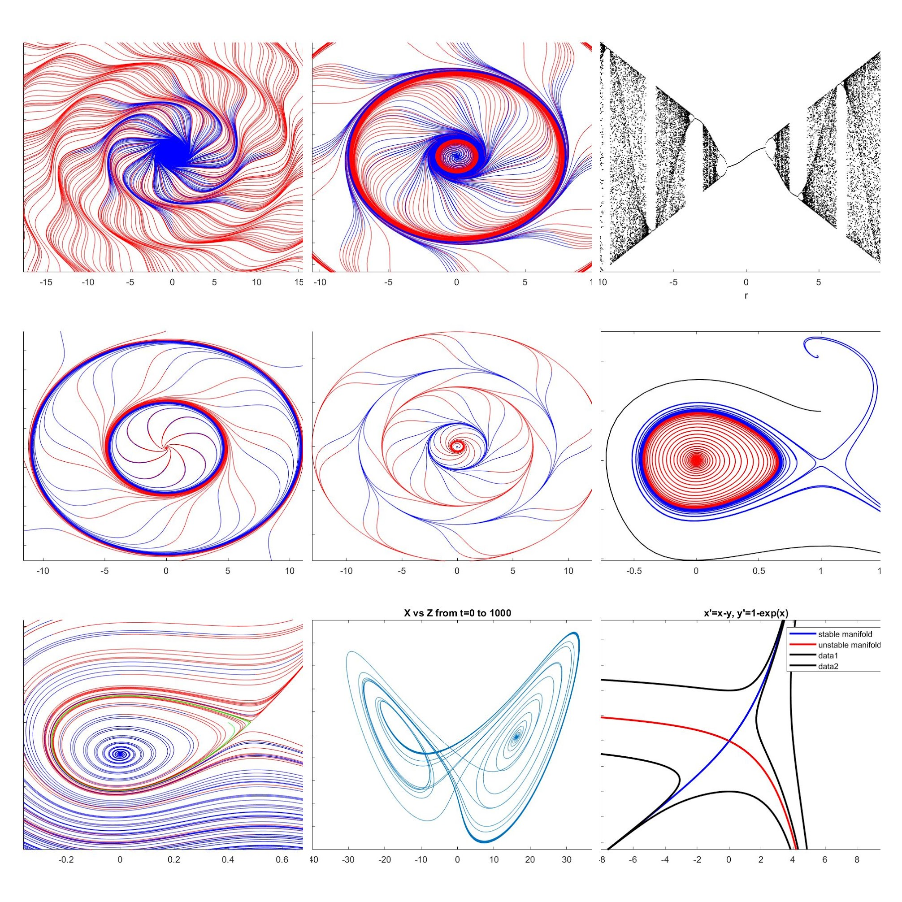

# non-linear-dynamics-and-chaos
This repository contains some interesting pieces of art created using matlab to plot phase portraits of chaotic dynamical systems.

An essential function is [plot_trajectory.m](./src/plot_trajectory.m), which uses a [Runge-Kutta](https://en.wikipedia.org/wiki/Runge%E2%80%93Kutta_methods) method.

## Example Phase Portraits
